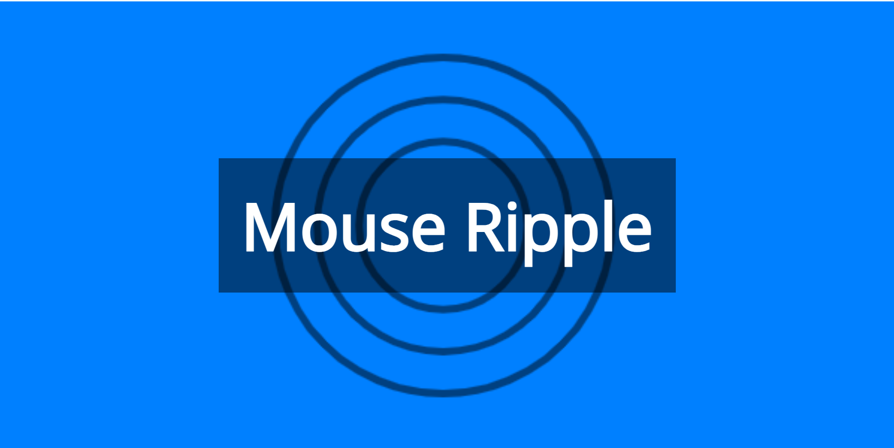
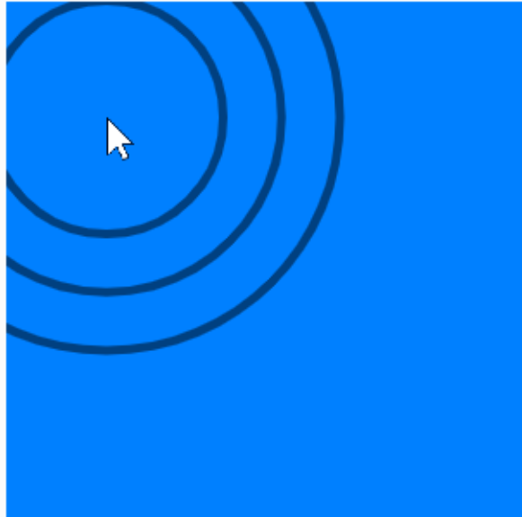
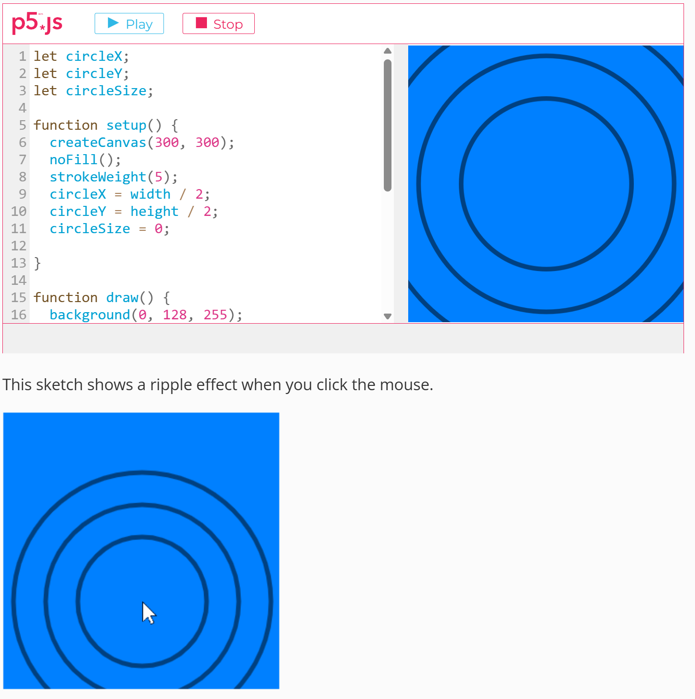

# Quiz 8 – Design Research

## Part 1: Imaging Technique Inspiration

### Inspiration: Mouse Ripple Interactive Visual

My inspiration comes from the "Mouse Ripple" example in Happy Coding's 
p5.js tutorials. The piece uses simple concentric circles that expand 
outward from wherever the user clicks, gradually fading as they grow. 
What inspires me is how such minimal visual elements—just circles—can 
create a powerful sense of presence and interaction; every click 
becomes a moment of cause and effect, like dropping a stone into still 
water. I'd like to incorporate this rippling, water-like aesthetic into 
my project, layering multiple ripples with colour and motion to build 
a meditative, responsive canvas. This technique suits the assignment 
because it transforms passive viewing into active participation.

*The Mouse Ripple example showing concentric circles expanding from a 
click point (Source: Happy Coding)*

*Close-up of the ripple effect demonstrating the layered, fading 
animation*

**Source**: [Happy Coding – Mouse Ripple](https://happycoding.io/tutorials/p5js/input/mouse-ripple)

---

## Part 2: Coding Technique Exploration

### Technique: mousePressed() with Expanding Circle Animation

To recreate and extend the Mouse Ripple effect, I plan to use p5.js's 
`mousePressed()` event combined with an array of "ripple objects." 
Each click creates a new ripple stored in the array, with properties 
for position, current radius, and transparency. In the `draw()` loop, 
every ripple expands its radius and decreases its alpha each frame, 
disappearing once fully transparent. Using a class to manage each 
ripple keeps the code modular and reusable. This technique is ideal 
for my user-input mechanic because it gives the audience direct, 
satisfying control over the visual output—every click leaves a 
visible, animated trace on the canvas.

*Live demo of the Mouse Ripple code running in the p5.js editor 
(Source: Happy Coding)*

**Example Implementation**: [Happy Coding – Mouse Ripple Code](https://happycoding.io/tutorials/p5js/input/mouse-ripple)

---

## My Mechanic in This Project

For this group project, I will be the creative director for the 
**User Input** mechanic. The Mouse Ripple inspiration and technique 
above directly support this role: I will use mouse events (clicks, 
movement, dragging) to let the audience actively shape the visual 
output, creating a canvas that responds in real time to every action.
